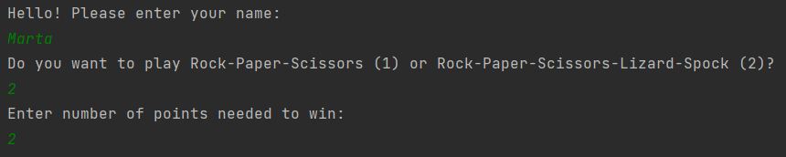
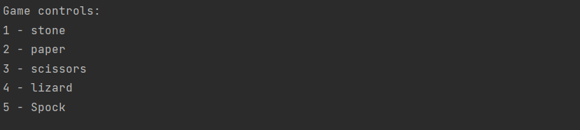
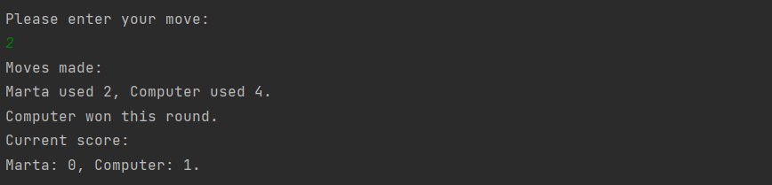
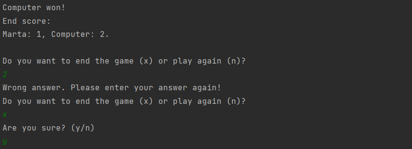

# Rock-Paper-Scissors-Lizard-Spock Game
Rock, paper, scissors game
This is a rock-paper-scissors-lizard-spock game created using Java 11. Player is competing against the computer. It's a console game developed using Scanner class and tested with JUnit framework.

## How does it work?
* First the player is asked to enter their name, number of points needed to win and to choose between RPS and RPSLS game mode.

* The controls are displayed and the game begins!

* After each move a short summary is displayed stating current round result and overall game score.

* The player can choose to end the game or play again.

